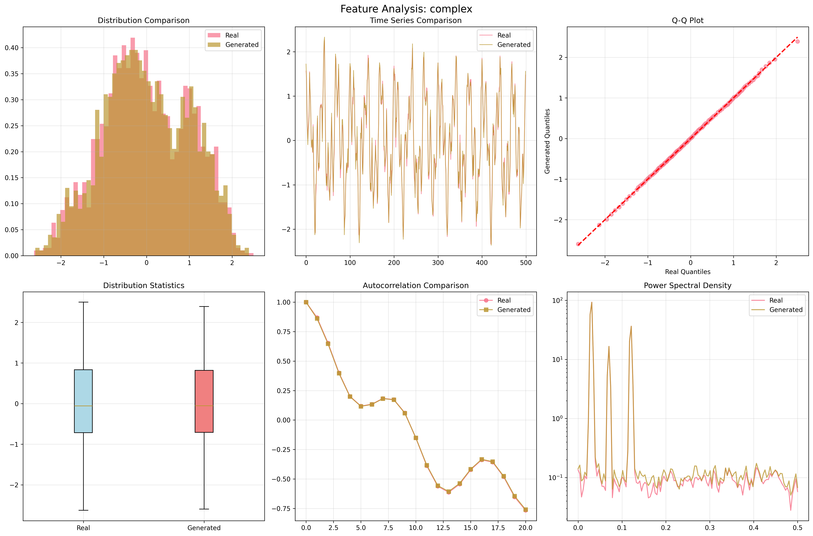
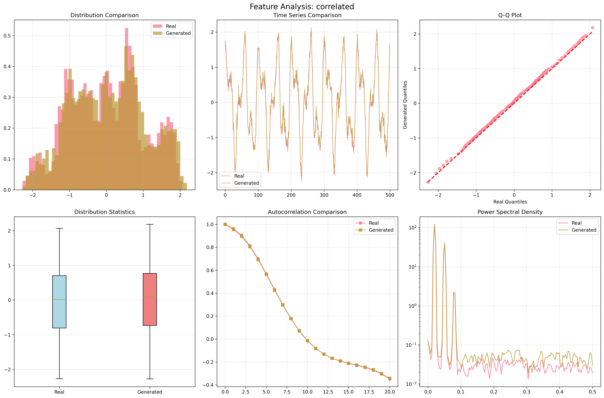
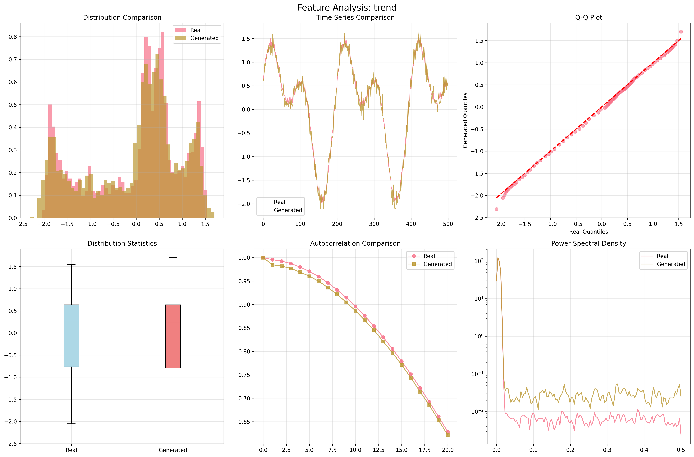
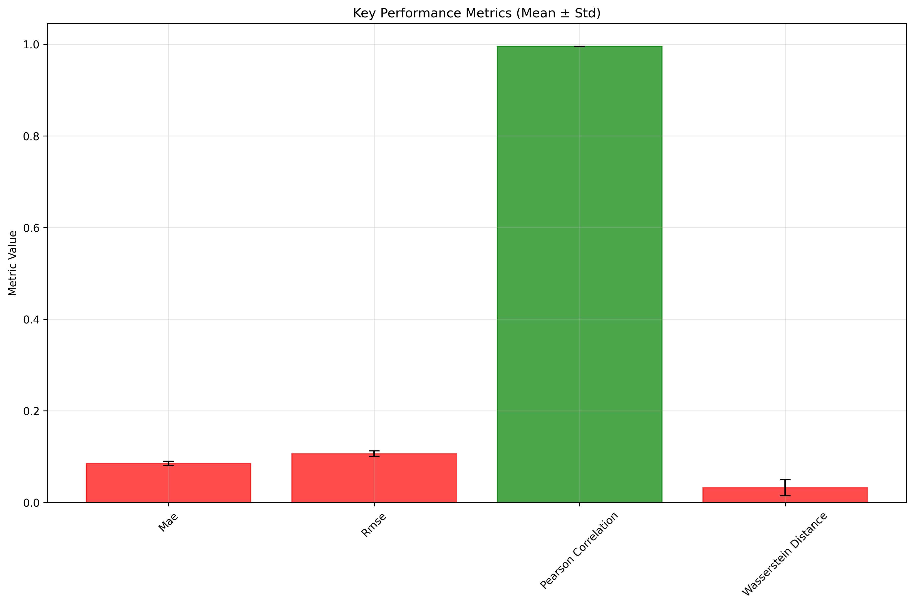
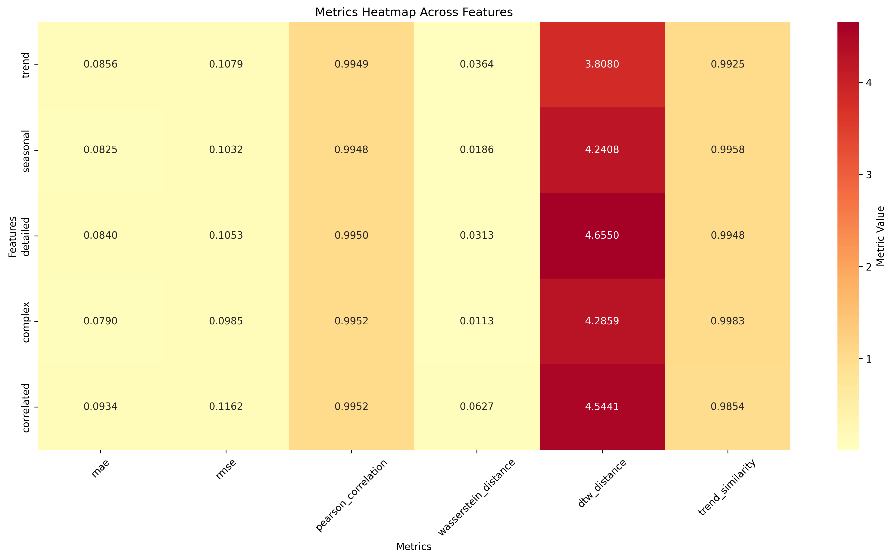
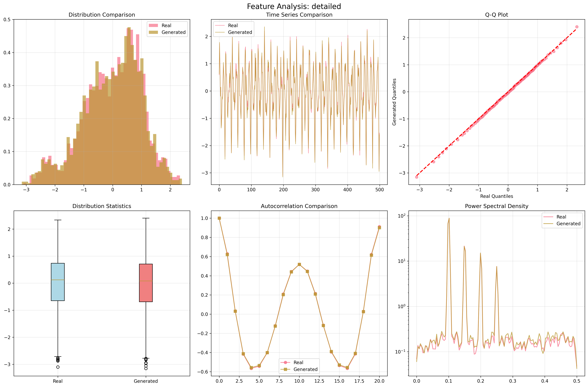
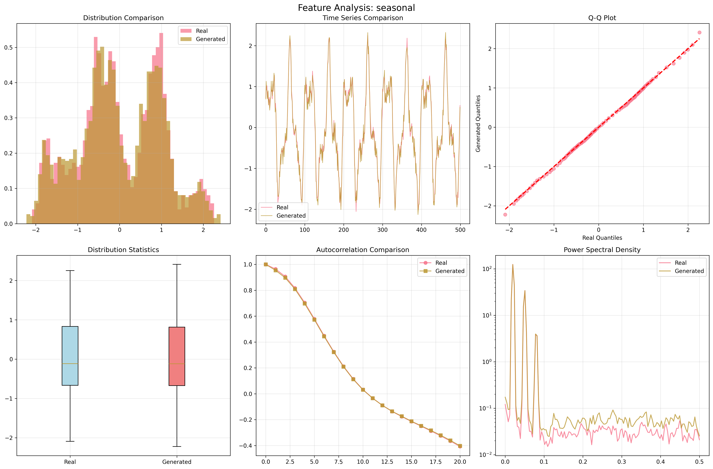

# QGAN Experiment Report: sin_data_benchmark
**Experiment ID:** 0001
**Created:** 2025-06-09T19:12:46.285168
**Description:** Comprehensive benchmark test using 5-feature sinusoidal synthetic data

================================================================================

## Dataset Information

- **Data Shape:** (2000, 5)
- **Features:** ['trend', 'seasonal', 'detailed', 'complex', 'correlated']
- **Time Series Length:** 2000
- **Number of Features:** 5

## Key Performance Summary

- **Mae Mean:** 0.084900 ± 0.004769
- **Rmse Mean:** 0.106215 ± 0.005838
- **Pearson Correlation Mean:** 0.994996 ± 0.000170
- **Wasserstein Distance Mean:** 0.032042 ± 0.017715

## Detailed Feature Analysis

### trend

- **MAE:** 0.085559
- **RMSE:** 0.107861
- **PEARSON_CORRELATION:** 0.994852
- **WASSERSTEIN_DISTANCE:** 0.036367
- **DTW_DISTANCE:** 3.808004

### seasonal

- **MAE:** 0.082462
- **RMSE:** 0.103236
- **PEARSON_CORRELATION:** 0.994778
- **WASSERSTEIN_DISTANCE:** 0.018581
- **DTW_DISTANCE:** 4.240807

### detailed

- **MAE:** 0.084045
- **RMSE:** 0.105293
- **PEARSON_CORRELATION:** 0.994972
- **WASSERSTEIN_DISTANCE:** 0.031339
- **DTW_DISTANCE:** 4.655012

### complex

- **MAE:** 0.079037
- **RMSE:** 0.098527
- **PEARSON_CORRELATION:** 0.995158
- **WASSERSTEIN_DISTANCE:** 0.011267
- **DTW_DISTANCE:** 4.285937

### correlated

- **MAE:** 0.093399
- **RMSE:** 0.116158
- **PEARSON_CORRELATION:** 0.995220
- **WASSERSTEIN_DISTANCE:** 0.062654
- **DTW_DISTANCE:** 4.544096

## Visualizations

### Feature Analysis Complex

### Feature Analysis Correlated

### Feature Analysis Trend

### Performance Summary

### Metrics Heatmap

### Feature Analysis Detailed

### Feature Analysis Seasonal

## Conclusions and Recommendations

### Performance Assessment
- ✅ **Excellent correlation** between real and generated data
- **Error levels:** MAE=0.0849, RMSE=0.1062

### Next Steps
- Consider hyperparameter tuning if performance is below expectations
- Analyze feature-specific performance for targeted improvements
- Compare with baseline models for context

## Technical Details

### Experiment Configuration
**Dataset Configuration:**
- length: 2000
- window_size: 50
- normalize: True
- add_regime_changes: False

### Files Generated
- Raw data: `data/sin_data.csv`
- Processed dataset: `data/benchmark_dataset.npz`
- QGAN output: `data/synthetic_qgan_output.npy`
- Metrics results: `metrics/evaluation_results.json`
- All plots: `plots/`

---
*Report generated on 2025-06-09 19:15:54*