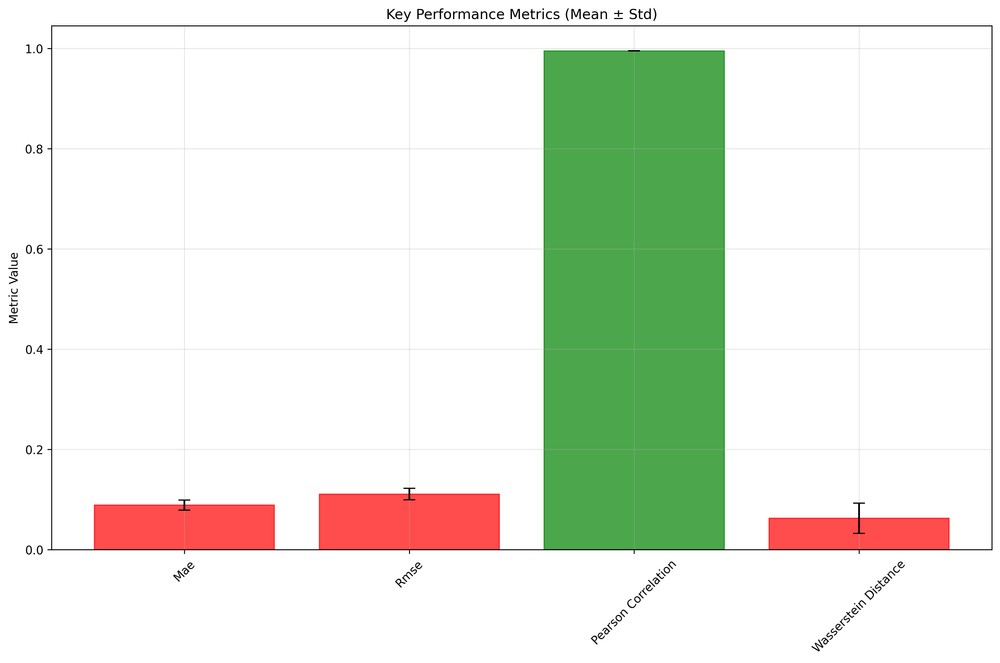

# QGAN Experiment Report: lucy_bioprocess_analysis
**Experiment ID:** 0002
**Created:** 2025-06-09T19:40:08.083668
**Description:** QGAN evaluation on Lucy bioprocess time series data

================================================================================

## Dataset Information

- **Data Shape:** (778, 5)
- **Features:** ['CELL', 'PAR_LIGHT', 'DO', 'PRE', 'OD']
- **Time Series Length:** 778
- **Number of Features:** 5

## Key Performance Summary

- **Mae Mean:** 0.088934 ± 0.010086
- **Rmse Mean:** 0.110784 ± 0.011219
- **Pearson Correlation Mean:** 0.995102 ± 0.000278
- **Wasserstein Distance Mean:** 0.062547 ± 0.030187

## Detailed Feature Analysis

### CELL

- **MAE:** 0.084875
- **RMSE:** 0.105759
- **PEARSON_CORRELATION:** 0.995114
- **WASSERSTEIN_DISTANCE:** 0.042992
- **DTW_DISTANCE:** 2.380721

### PAR_LIGHT

- **MAE:** 0.085125
- **RMSE:** 0.107258
- **PEARSON_CORRELATION:** 0.994718
- **WASSERSTEIN_DISTANCE:** 0.084374
- **DTW_DISTANCE:** 2.991053

### DO

- **MAE:** 0.084597
- **RMSE:** 0.106606
- **PEARSON_CORRELATION:** 0.995202
- **WASSERSTEIN_DISTANCE:** 0.051779
- **DTW_DISTANCE:** 2.461550

### PRE

- **MAE:** 0.108899
- **RMSE:** 0.132852
- **PEARSON_CORRELATION:** 0.995549
- **WASSERSTEIN_DISTANCE:** 0.108899
- **DTW_DISTANCE:** 3.705584

### OD

- **MAE:** 0.081175
- **RMSE:** 0.101444
- **PEARSON_CORRELATION:** 0.994927
- **WASSERSTEIN_DISTANCE:** 0.024691
- **DTW_DISTANCE:** 2.386484

## Visualizations

### Feature Analysis Par Light

### Feature Analysis Od

### Feature Analysis Cell

### Performance Summary

### Feature Analysis Pre

### Metrics Heatmap

### Feature Analysis Do

## Conclusions and Recommendations

### Performance Assessment
- ✅ **Excellent correlation** between real and generated data
- **Error levels:** MAE=0.0889, RMSE=0.1108

### Next Steps
- Consider hyperparameter tuning if performance is below expectations
- Analyze feature-specific performance for targeted improvements
- Compare with baseline models for context

## Technical Details

### Experiment Configuration

### Files Generated
- Raw data: `data/sin_data.csv`
- Processed dataset: `data/benchmark_dataset.npz`
- QGAN output: `data/synthetic_qgan_output.npy`
- Metrics results: `metrics/evaluation_results.json`
- All plots: `plots/`

---
*Report generated on 2025-06-09 19:40:44*