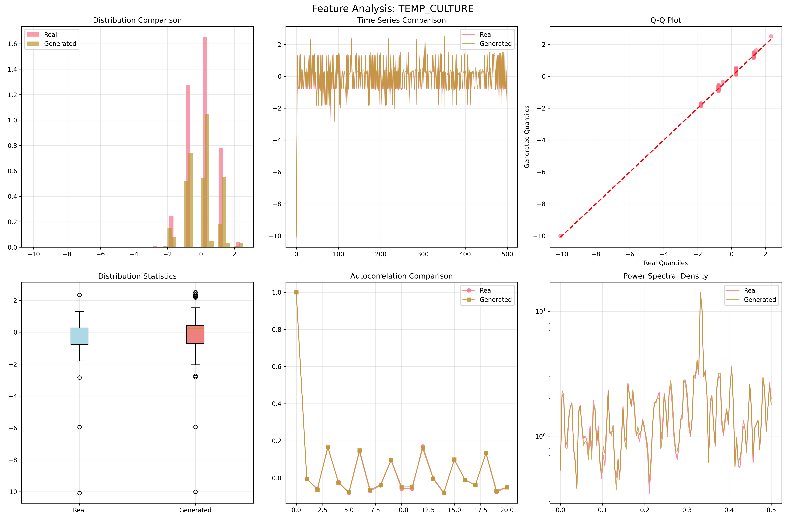
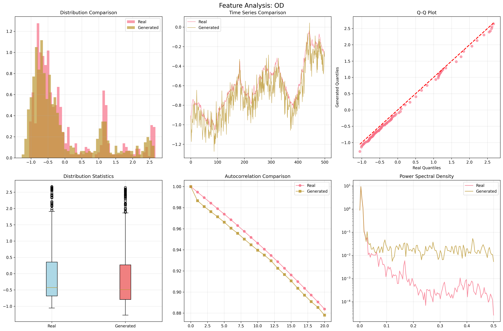
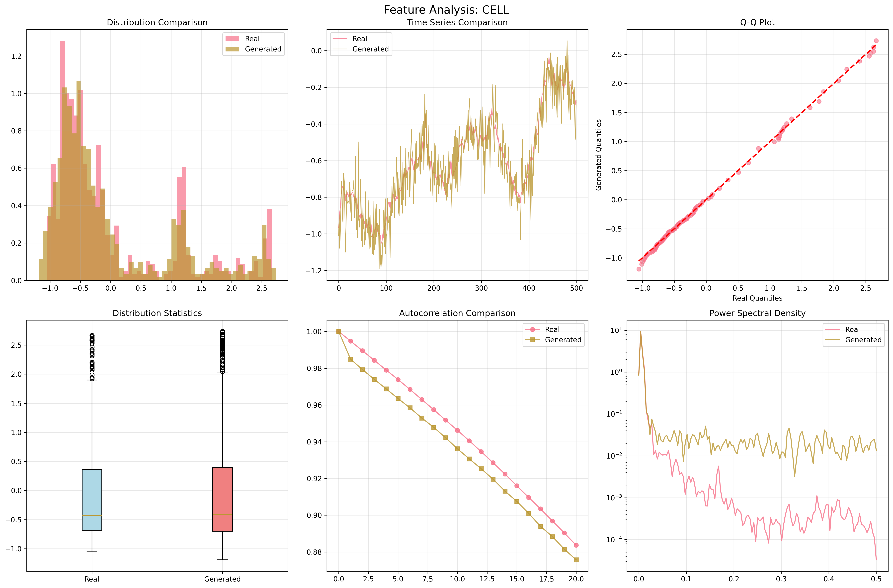
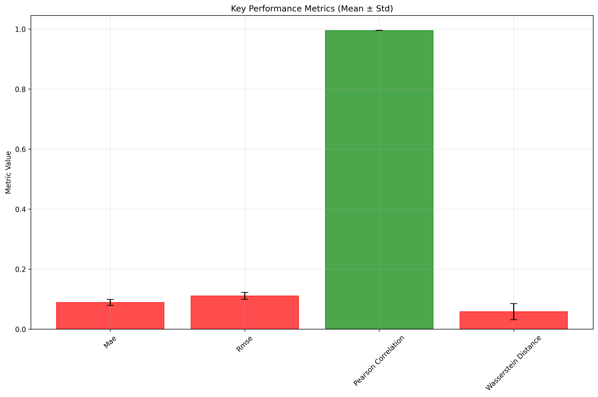
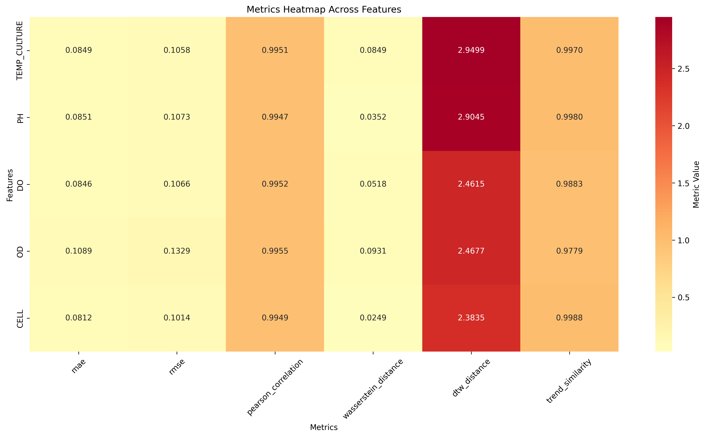
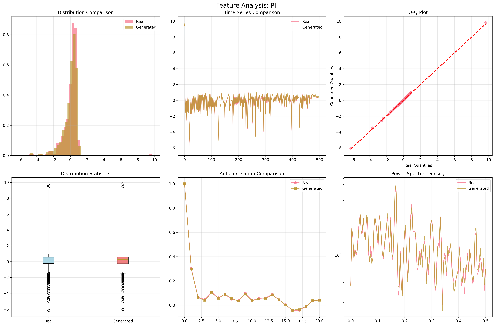
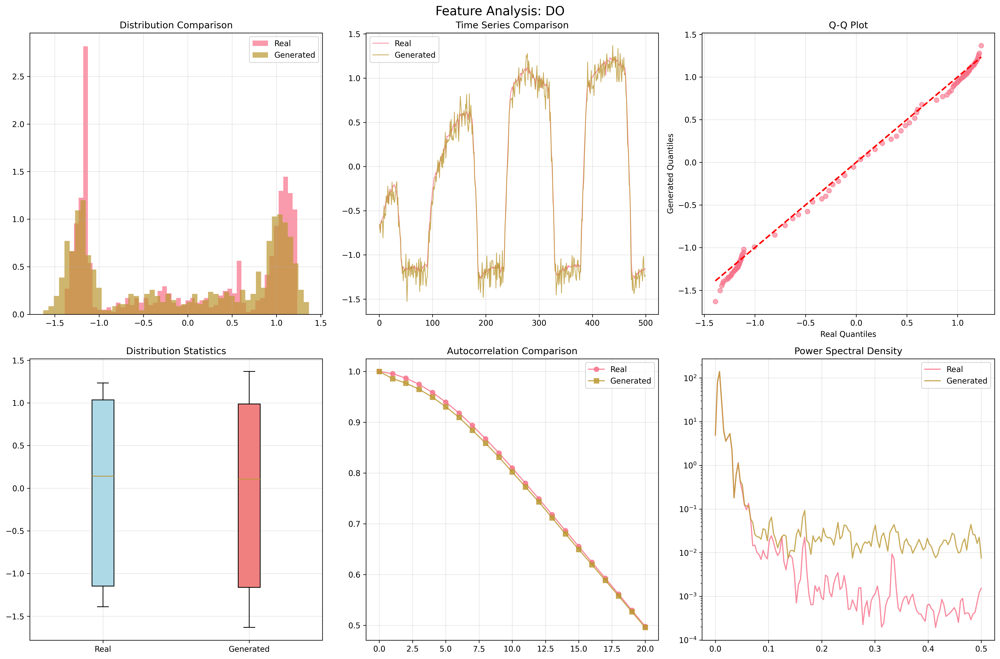

# QGAN Experiment Report: lucy_bioprocess_selected
**Experiment ID:** 0003
**Created:** 2025-06-09T19:40:44.557760
**Description:** QGAN evaluation on selected Lucy bioprocess features

================================================================================

## Dataset Information

- **Data Shape:** (778, 5)
- **Features:** ['TEMP_CULTURE', 'PH', 'DO', 'OD', 'CELL']
- **Time Series Length:** 778
- **Number of Features:** 5

## Key Performance Summary

- **Mae Mean:** 0.088934 ± 0.010086
- **Rmse Mean:** 0.110784 ± 0.011219
- **Pearson Correlation Mean:** 0.995091 ± 0.000277
- **Wasserstein Distance Mean:** 0.057990 ± 0.026853

## Detailed Feature Analysis

### TEMP_CULTURE

- **MAE:** 0.084875
- **RMSE:** 0.105759
- **PEARSON_CORRELATION:** 0.995119
- **WASSERSTEIN_DISTANCE:** 0.084875
- **DTW_DISTANCE:** 2.949909

### PH

- **MAE:** 0.085125
- **RMSE:** 0.107258
- **PEARSON_CORRELATION:** 0.994690
- **WASSERSTEIN_DISTANCE:** 0.035238
- **DTW_DISTANCE:** 2.904491

### DO

- **MAE:** 0.084597
- **RMSE:** 0.106606
- **PEARSON_CORRELATION:** 0.995202
- **WASSERSTEIN_DISTANCE:** 0.051779
- **DTW_DISTANCE:** 2.461550

### OD

- **MAE:** 0.108899
- **RMSE:** 0.132852
- **PEARSON_CORRELATION:** 0.995518
- **WASSERSTEIN_DISTANCE:** 0.093120
- **DTW_DISTANCE:** 2.467653

### CELL

- **MAE:** 0.081175
- **RMSE:** 0.101444
- **PEARSON_CORRELATION:** 0.994927
- **WASSERSTEIN_DISTANCE:** 0.024940
- **DTW_DISTANCE:** 2.383512

## Visualizations

### Feature Analysis Temp Culture

### Feature Analysis Od

### Feature Analysis Cell

### Performance Summary

### Metrics Heatmap

### Feature Analysis Ph

### Feature Analysis Do

## Conclusions and Recommendations

### Performance Assessment
- ✅ **Excellent correlation** between real and generated data
- **Error levels:** MAE=0.0889, RMSE=0.1108

### Next Steps
- Consider hyperparameter tuning if performance is below expectations
- Analyze feature-specific performance for targeted improvements
- Compare with baseline models for context

## Technical Details

### Experiment Configuration

### Files Generated
- Raw data: `data/sin_data.csv`
- Processed dataset: `data/benchmark_dataset.npz`
- QGAN output: `data/synthetic_qgan_output.npy`
- Metrics results: `metrics/evaluation_results.json`
- All plots: `plots/`

---
*Report generated on 2025-06-09 19:41:20*